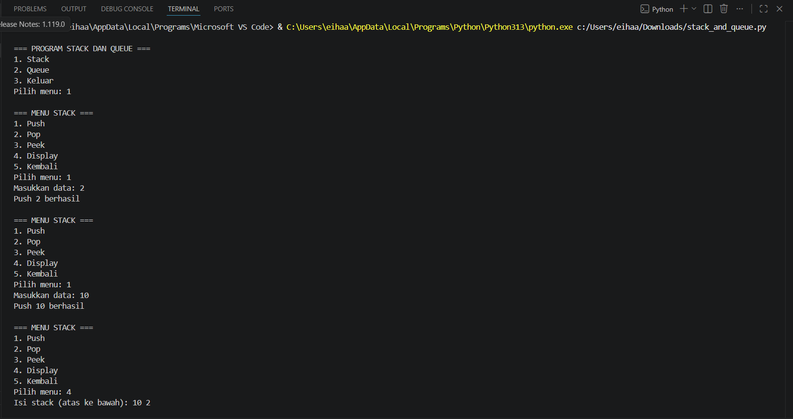
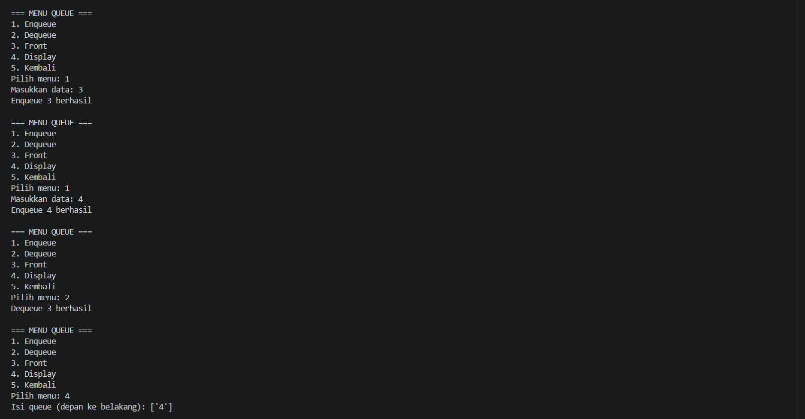

# Judul 4 - Stack and Queue

## Deskripsi
Program ini dibuat menggunakan bahasa Python untuk mengimplementasikan struktur data Stack dan Queue.

## Fitur Stack
- Push
- Pop
- Peek
- Display

## Fitur Queue
- Enqueue
- Dequeue
- Front
- Display

### Stack Output

### Queue Output

## Link Video YouTube
https://youtu.be/1HNLR59T7DE
